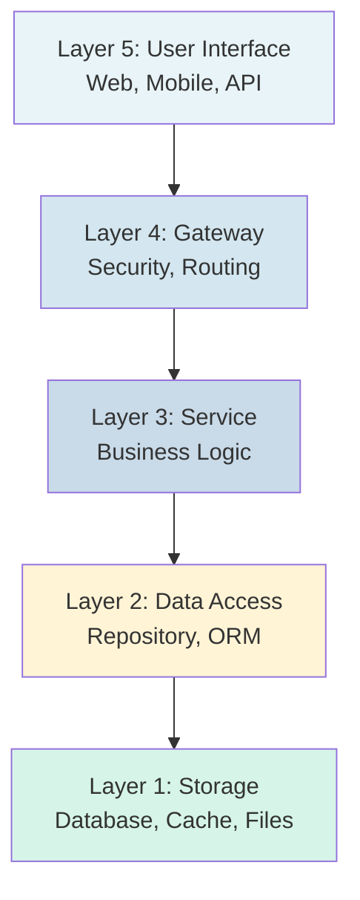
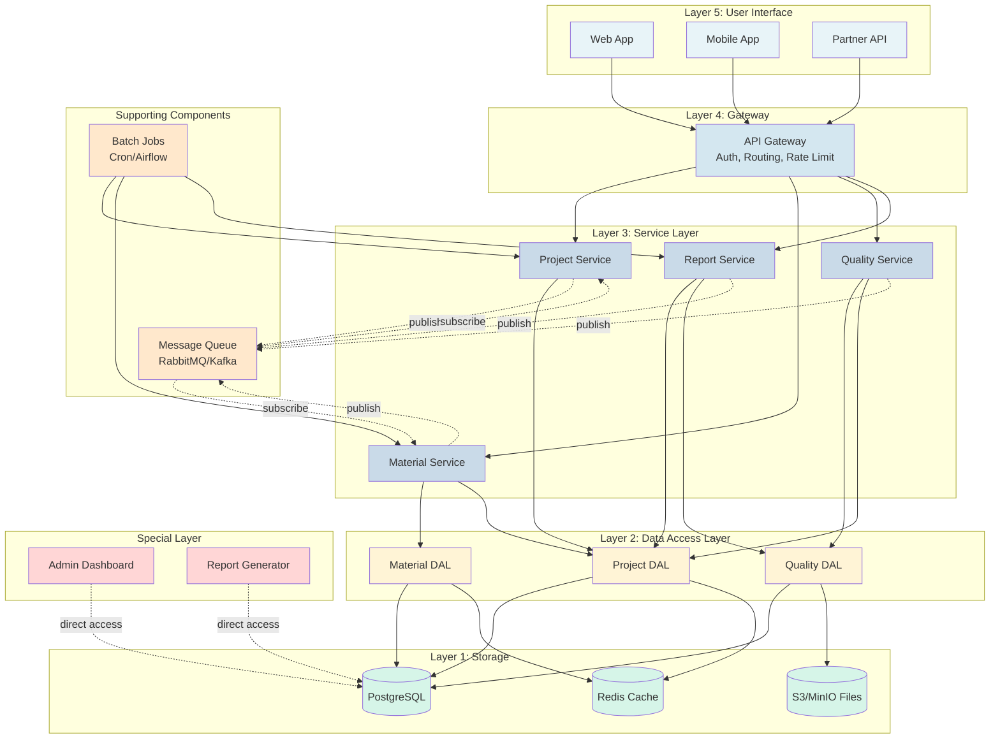
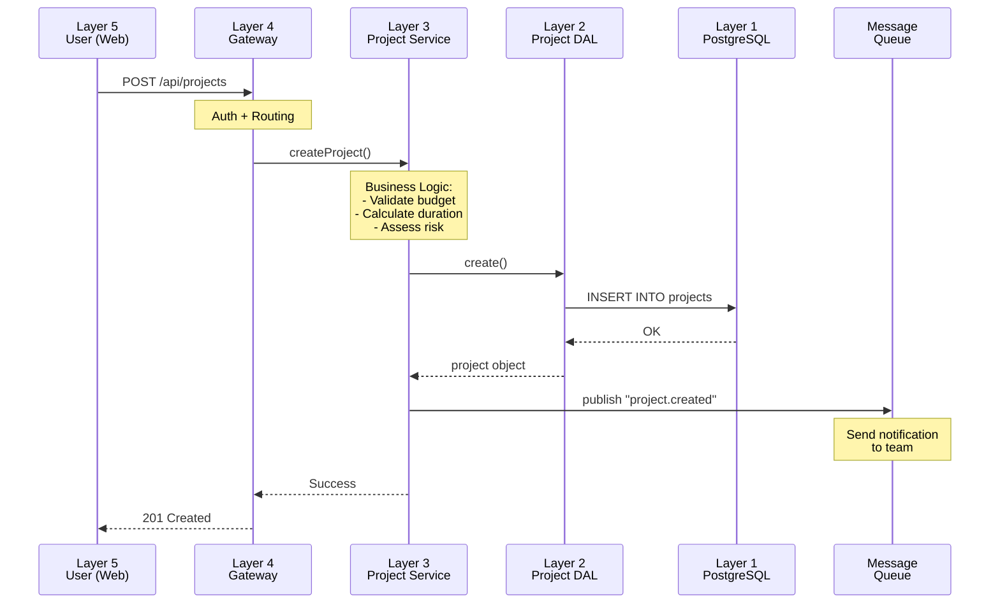
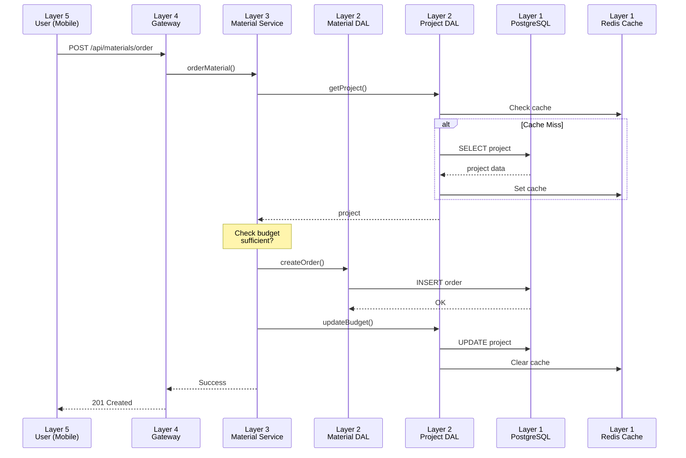
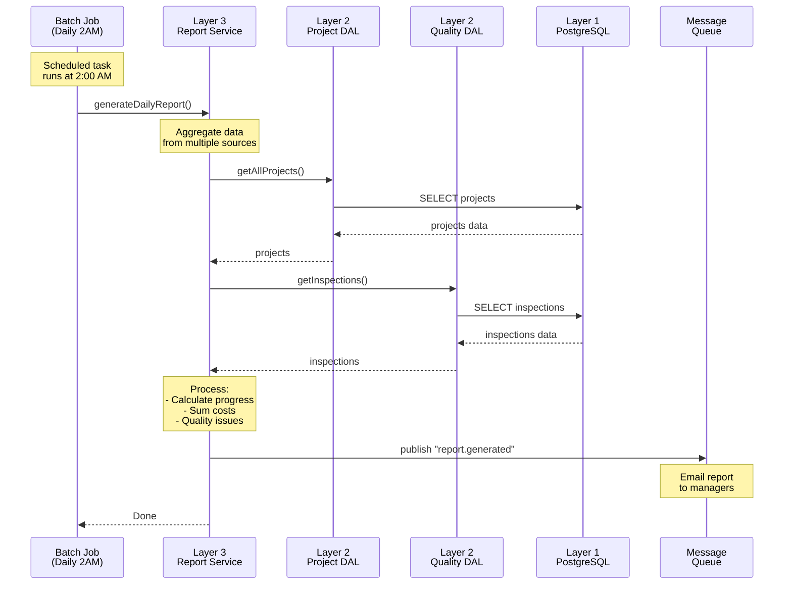
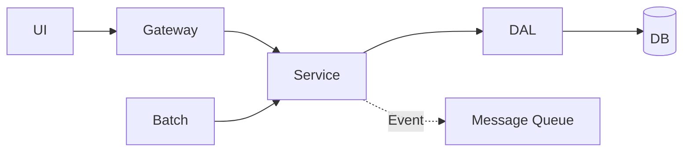
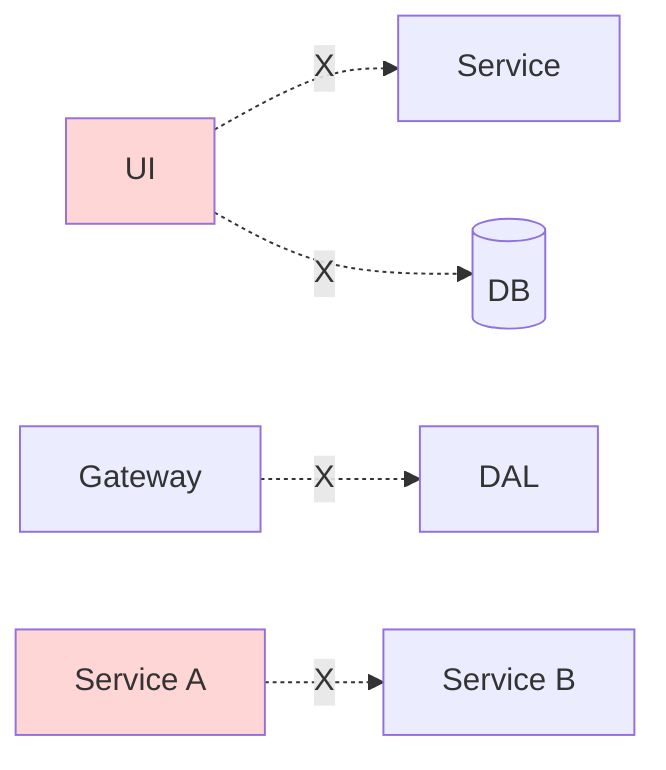

# 5-Layer Architecture - Construction Project Management System

## Opening Script

**Duration**: 5 minutes

"Hello everyone! Today we're going to learn about **5-Layer Architecture** - one of the most popular architectures when building large-scale systems.

First, I'd like to ask: **When you code a small project, what do you usually do?**
- Maybe all code sits in 1 file?
- Or split into a few files but without clear rules?
- As the project grows, finding bugs and adding new features becomes really difficult?

**The Problem**: When a project grows from 5 people to 50 people, from 10 features to 100 features, we need a clear **organizational structure**.

**The Solution**: 5-Layer Architecture helps us:
- ✅ Break down the system into clear parts
- ✅ Each team is responsible for a specific layer
- ✅ Easier to maintain, scale, and test

Today, we'll learn through a real-world example: **Construction Project Management System**. This is a complex system with many features, making it perfect for illustrating 5-Layer Architecture."

---

## Introduction

This document illustrates 5-Layer Architecture through a practical example: Construction Project Management System.

**System Features**:
- Project management (progress, budget, workforce)
- Material management
- Quality inspection
- Reporting

**Target Audience**: First-year students, software architecture beginners

**Learning Objectives**:
1. Understand the role of each layer in the architecture
2. Know how to apply 5-Layer Architecture to real projects
3. Grasp the communication rules between layers
4. Distinguish when to use and when not to use this architecture

---

## 5-Layer Overview

**Principle**: Each layer only communicates with the layer directly below it (Closed Layer Architecture).

---

## Complete System Diagram

**Component Explanation**:
- **Layer 5**: 3 types of clients (Web, Mobile, Partner API)
- **Layer 4**: API Gateway handles security and routing
- **Layer 3**: 4 Services handle business logic
- **Layer 2**: 3 DAL repositories access data
- **Layer 1**: 3 storage types (Database, Cache, Files)
- **Message Queue**: Asynchronous communication between Services
- **Batch Jobs**: Scheduled automated tasks
- **Special Layer**: Admin tools (bypass 5 layers)

---

### Cloud Deployment Options

| Layer | AWS Traditional | AWS Modern | GCP Traditional | GCP Modern |
|-------|----------------|------------|-----------------|------------|
| **Layer 5** | EC2 + Nginx | S3 + CloudFront | Compute Engine + Nginx | Cloud Storage + CDN |
| **Layer 4** | EC2 + HAProxy | API Gateway + WAF | Compute Engine + LB | Cloud Load Balancing |
| **Layer 3** | EC2 + Docker | Lambda / ECS Fargate | Compute Engine + Docker | Cloud Run / Functions |
| **Layer 2** | EC2 + Redis | ElastiCache (Redis) | Compute Engine + Redis | Memorystore (Redis) |
| **Layer 1** | EC2 + PostgreSQL | RDS / Aurora | Compute Engine + PostgreSQL | Cloud SQL / Spanner |
| **Queue** | EC2 + RabbitMQ/Kafka | SQS / SNS / EventBridge | Compute Engine + RabbitMQ | Pub/Sub |
| **Batch** | EC2 + Cron | Lambda / Fargate + EventBridge | Compute Engine + Cron | Cloud Run + Scheduler |
| **Special** | EC2 Bastion Host | Session Manager | Compute Engine Bastion | Cloud Shell + IAP |

**Recommended Hybrid**:
- Layer 5, 4: Modern (serverless, auto-scale)
- Layer 3: Hybrid (stable workload on VMs + burst traffic on serverless)
- Layer 2, 1: Modern (managed services, zero ops)
- Queue, Batch: Modern (serverless)

---

## Layer Details

### Layer 5: User Interface

**Purpose**: User interface, handle input, display output.

**Examples**:
- **Web App**: Project dashboard, material management, reports
- **Mobile App**: Site check-in, photo capture, progress updates
- **Partner API**: Supplier order view, contractor progress updates

**Rules**:
- ✅ Only call APIs through Gateway
- ❌ No direct access to Service or Database

---

### Layer 4: Gateway

**Purpose**: Single entry point, handle security, routing.

**Responsibilities**:
1. **Authentication**: Verify JWT token
2. **Authorization**: Check access permissions
3. **Rate Limiting**: Limit requests/minute
4. **Routing**: Forward request to correct Service
5. **Logging**: Log all requests

**Rules**:
- ✅ Forward requests to Service Layer
- ❌ No business logic
- ❌ No Database access

---

### Layer 3: Service

**Purpose**: Handle business logic, orchestrate Data Access Layer.

**Example Services**:
- **Project Service**: Create projects, calculate budget, assign workforce
- **Material Service**: Order materials, check inventory
- **Quality Service**: Quality inspection, calculate scores

**Rules**:
- ✅ Contains all business logic
- ✅ Call multiple DALs to complete tasks
- ❌ No direct Database access
- ❌ Services don't call other Services (use Message Queue)

---

### Layer 2: Data Access

**Purpose**: Abstract database, provide API for Services.

**Responsibilities**:
- **Repository Pattern**: CRUD operations
- **ORM Mapping**: Object ↔ Table
- **Caching**: Redis cache for performance
- **Validation**: Check data types, lengths

**Rules**:
- ✅ Only Service Layer can call
- ✅ Handle all database operations
- ❌ No business logic

---

### Layer 1: Storage

**Purpose**: Physical data storage.

**Components**:
- **PostgreSQL**: Main data storage (projects, materials, users)
- **Redis**: Cache for faster queries
- **S3/MinIO**: File storage (contract PDFs, site photos)

**Rules**:
- ❌ No direct access from Service
- ✅ Only Data Access Layer can access

---

## Supporting Components

### Message Queue (RabbitMQ/Kafka)

**Purpose**: Asynchronous communication between Services.

**How it works**:
- Service publishes event to Queue
- Other Services subscribe and handle event
- Example: `material.ordered` → Notification Service sends notification

**Benefits**:
- Reduce coupling between Services
- Non-blocking, asynchronous processing
- Auto-retry on failure

---

### Batch Jobs (Scheduled Tasks)

**Purpose**: Handle periodic tasks.

**Examples**:
- **Daily (2:00 AM)**: Calculate project progress, check inventory
- **Weekly (Sunday)**: Weekly quality report
- **Monthly (1st)**: Monthly report, archive old projects

**Rules**:
- ✅ Call Service Layer (follow architecture)
- ❌ No direct Database access

---

### Special Layer

**Purpose**: Internal tools, direct Database access.

**Examples**:
- **Admin Dashboard**: User management, emergency data fixes
- **Report Generator**: Complex reports (JOIN multiple tables)
- **Data Migration**: Bulk import/export

**Rules**:
- ⚠️ Admin/superuser only
- ⚠️ Audit log required
- ⚠️ Internal tools only

---

## Use Case 1: Create New Project

**Explanation**:
1. User creates project via Web
2. Gateway authenticates and routes
3. Project Service handles business logic
4. Project DAL saves to Database
5. Publish event to send notification
6. Return result to User

**Layers involved**: Layer 5 → 4 → 3 → 2 → 1 + Message Queue

---

## Use Case 2: Order Materials

**Explanation**:
1. User orders materials via Mobile
2. Material Service checks project budget
3. Use Cache for performance
4. Create order and update budget
5. Clear cache to ensure fresh data

**Layers involved**: Layer 5 → 4 → 3 → 2 → 1 (Database + Cache)

**Special note**: Service calls 2 DALs (Material DAL + Project DAL)

---

## Use Case 3: Daily Automated Report

**Explanation**:
1. Batch Job runs automatically at 2:00 AM
2. Report Service collects data from multiple DALs
3. Process and aggregate report
4. Publish event to send email report
5. Complete without user interaction

**Layers involved**: Batch Job → Layer 3 → 2 → 1 + Message Queue

**Special note**: No Layer 5 (UI), batch runs automatically

---

## Comparison: With vs Without 5 Layers

| Criteria | Without 5 Layers | With 5 Layers |
|----------|------------------|---------------|
| **Database Change** | Modify many files (2-3 months) | Only modify DAL (1-2 weeks) |
| **Testing** | Hard to test, need real DB | Easy to test with mocks |
| **Scaling** | Scale entire system (expensive) | Scale each layer independently |
| **Team Work** | Many conflicts when merging | Few conflicts, clear responsibilities |
| **Code Reuse** | Duplicate logic everywhere | Reuse Service for multiple clients |
| **Bug Fixing** | Hard to locate bugs | Easy to identify faulty layer |

---

## Key Benefits

### 1. Separation of Concerns
Each layer has distinct responsibilities, no overlap.

### 2. Maintainability
Easy to maintain: changing one layer doesn't affect others.

### 3. Scalability
Independent scaling: scale the layer that needs more resources.

### 4. Testability
Easy to test: mock lower layer, test current layer logic.

### 5. Reusability
One Service used by multiple clients (Web, Mobile, API).

---

## Important Rules

### ✅ ALLOWED

### ❌ NOT ALLOWED

**Golden Rules**:
- Only communicate with adjacent layer
- No skipping layers
- Services don't call Services (use Message Queue)

---

## When to Use?

### ✅ SHOULD use when:
- Large projects with many features
- Team > 5 people
- Long-term maintenance (> 2 years)
- Multiple clients (Web, Mobile, Partner API)
- Complex business logic

### ❌ SHOULD NOT use when:
- Prototype, POC
- Small, simple projects
- Team < 3 people
- Tight deadline
- Simple business logic (basic CRUD)

---

## Conclusion

**5-Layer Architecture** helps:
- Clear, understandable code
- Easy to maintain and extend
- Efficient team collaboration
- Fewer bugs, higher quality

**Trade-off**: More complex, requires team understanding of architecture.

**Recommendation**: Start simple (3 layers), expand gradually when needed.
