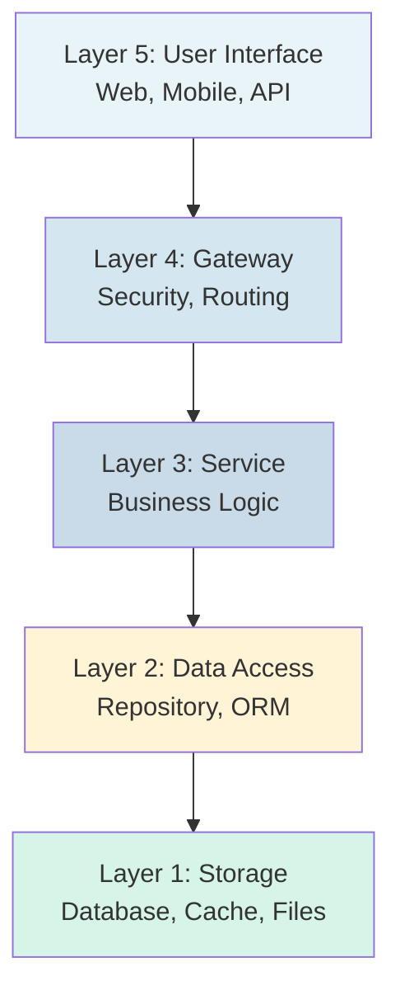
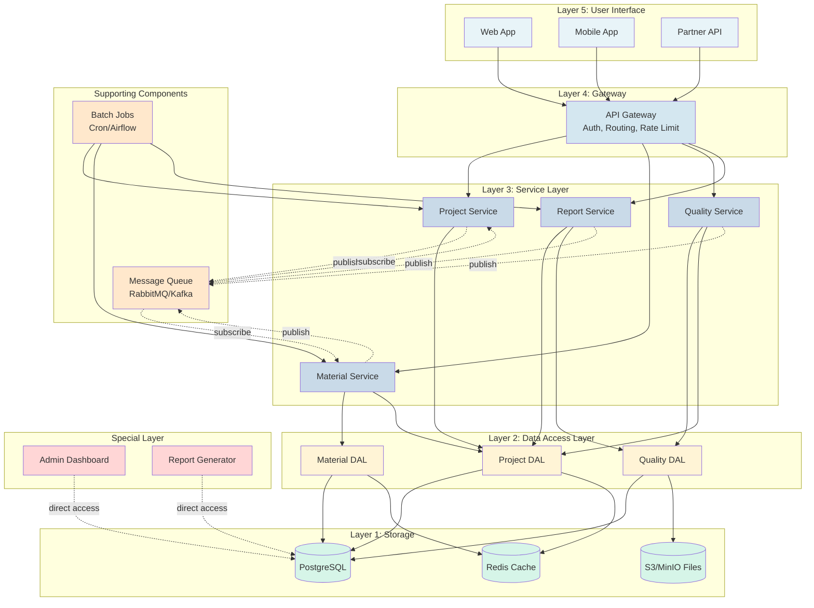
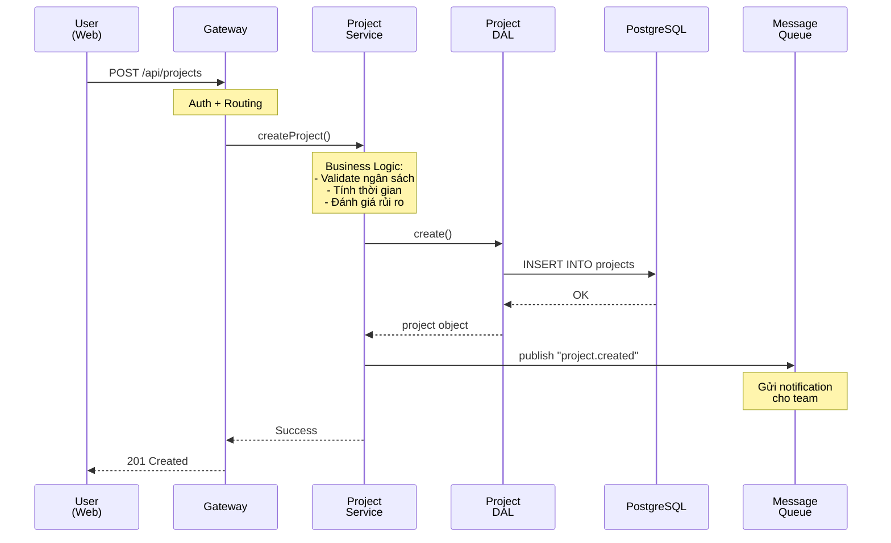
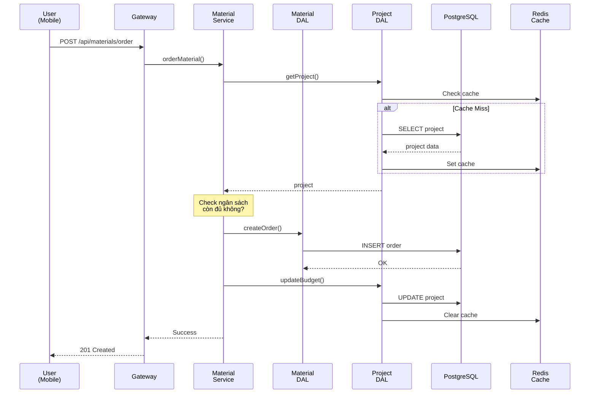
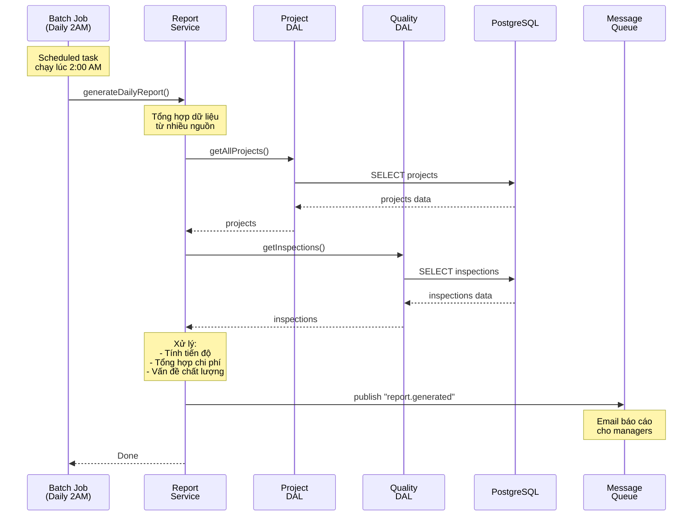
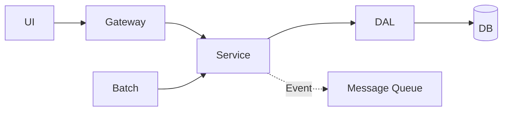
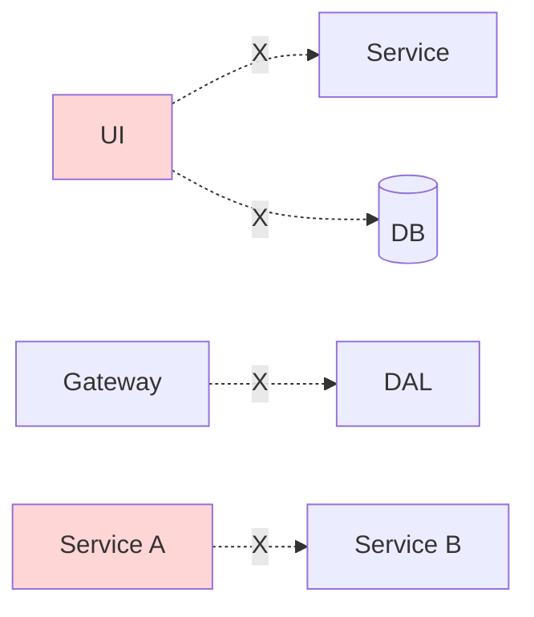

# Kiến trúc 5 Tầng - Phần mềm Quản lý Dự án Xây dựng

## Giới thiệu

Tài liệu này minh họa kiến trúc 5 tầng (5-Layer Architecture) qua ví dụ thực tế: Phần mềm quản lý dự án xây dựng.

**Hệ thống gồm**:
- Quản lý dự án (tiến độ, ngân sách, nhân lực)
- Quản lý vật tư
- Kiểm tra chất lượng
- Báo cáo

---

## Tổng quan 5 Tầng

**Nguyên tắc**: Mỗi tầng chỉ giao tiếp với tầng liền kề bên dưới (Closed Layer Architecture).

---

## Sơ đồ Hệ thống Đầy đủ

**Giải thích các thành phần**:
- **Layer 5**: 3 loại clients (Web, Mobile, Partner API)
- **Layer 4**: API Gateway xử lý security và routing
- **Layer 3**: 4 Services xử lý business logic
- **Layer 2**: 3 DAL repositories truy cập dữ liệu
- **Layer 1**: 3 loại storage (Database, Cache, Files)
- **Message Queue**: Giao tiếp bất đồng bộ giữa Services
- **Batch Jobs**: Tác vụ định kỳ tự động
- **Special Layer**: Công cụ admin (bypass 5 layers)

---

## Chi tiết Các Tầng

### Layer 5: User Interface (Giao diện)

**Chức năng**: Giao diện người dùng, nhận input, hiển thị output.

**Ví dụ**:
- **Web App**: Dashboard dự án, quản lý vật tư, báo cáo
- **Mobile App**: Check-in công trường, chụp ảnh, cập nhật tiến độ
- **Partner API**: Nhà cung cấp xem đơn hàng, nhà thầu cập nhật tiến độ

**Quy tắc**:
- ✅ Chỉ gọi API qua Gateway
- ❌ Không truy cập trực tiếp Service hoặc Database

---

### Layer 4: Gateway (Cổng API)

**Chức năng**: Điểm truy cập duy nhất, xử lý security, routing.

**Nhiệm vụ**:
1. **Authentication**: Verify JWT token
2. **Authorization**: Kiểm tra quyền truy cập
3. **Rate Limiting**: Giới hạn số requests/phút
4. **Routing**: Chuyển request đến đúng Service
5. **Logging**: Ghi log mọi request

**Quy tắc**:
- ✅ Forward requests đến Service Layer
- ❌ Không chứa business logic
- ❌ Không truy cập Database

---

### Layer 3: Service (Nghiệp vụ)

**Chức năng**: Xử lý business logic, điều phối Data Access Layer.

**Ví dụ Services**:
- **Project Service**: Tạo dự án, tính ngân sách, phân công nhân sự
- **Material Service**: Đặt hàng vật tư, kiểm tra tồn kho
- **Quality Service**: Kiểm tra chất lượng, tính điểm đánh giá

**Quy tắc**:
- ✅ Chứa tất cả business logic
- ✅ Gọi nhiều DAL để hoàn thành nghiệp vụ
- ❌ Không truy cập trực tiếp Database
- ❌ Service không gọi Service khác (dùng Message Queue)

---

### Layer 2: Data Access (Truy cập Dữ liệu)

**Chức năng**: Trừu tượng hóa database, cung cấp API cho Service.

**Nhiệm vụ**:
- **Repository Pattern**: CRUD operations
- **ORM Mapping**: Object ↔ Table
- **Caching**: Redis cache để tăng performance
- **Validation**: Kiểm tra kiểu dữ liệu, độ dài

**Quy tắc**:
- ✅ Chỉ Service Layer được gọi
- ✅ Xử lý mọi database operations
- ❌ Không chứa business logic

---

### Layer 1: Storage (Lưu trữ)

**Chức năng**: Lưu trữ dữ liệu vật lý.

**Thành phần**:
- **PostgreSQL**: Lưu dữ liệu chính (projects, materials, users)
- **Redis**: Cache để tăng tốc độ truy vấn
- **S3/MinIO**: Lưu files (hợp đồng PDF, ảnh hiện trường)

**Quy tắc**:
- ❌ Không được truy cập trực tiếp từ Service
- ✅ Chỉ Data Access Layer được truy cập

---

## Các Thành phần Bổ sung

### Message Queue (RabbitMQ/Kafka)

**Mục đích**: Giao tiếp bất đồng bộ giữa các Services.

**Cách hoạt động**:
- Service publish event lên Queue
- Service khác subscribe và xử lý event
- Ví dụ: `material.ordered` → Notification Service gửi thông báo

**Lợi ích**:
- Giảm coupling giữa Services
- Không blocking, xử lý bất đồng bộ
- Retry tự động nếu fail

---

### Batch Jobs (Scheduled Tasks)

**Mục đích**: Xử lý tác vụ định kỳ.

**Ví dụ**:
- **Daily (2:00 AM)**: Tính tiến độ dự án, kiểm tra tồn kho
- **Weekly (Chủ nhật)**: Báo cáo chất lượng tuần
- **Monthly (Ngày 1)**: Báo cáo tháng, archive dự án cũ

**Quy tắc**:
- ✅ Gọi Service Layer (tuân thủ kiến trúc)
- ❌ Không truy cập trực tiếp Database

---

### Special Layer

**Mục đích**: Công cụ nội bộ, truy cập trực tiếp Database.

**Ví dụ**:
- **Admin Dashboard**: Quản lý users, sửa dữ liệu khẩn cấp
- **Report Generator**: Báo cáo phức tạp (query JOIN nhiều bảng)
- **Data Migration**: Import/Export bulk data

**Quy tắc**:
- ⚠️ Chỉ admin/superuser
- ⚠️ Bắt buộc có audit log
- ⚠️ Chỉ dùng cho internal tools

---

## Use Case 1: Tạo Dự án Mới

**Giải thích**:
1. User tạo dự án qua Web
2. Gateway xác thực và routing
3. Project Service xử lý business logic
4. Project DAL lưu vào Database
5. Publish event để gửi notification
6. Trả kết quả về User

**Đi qua các tầng**: Layer 5 → 4 → 3 → 2 → 1 + Message Queue

---

## Use Case 2: Đặt Hàng Vật Tư

**Giải thích**:
1. User đặt hàng vật tư qua Mobile
2. Material Service kiểm tra ngân sách dự án
3. Sử dụng Cache để tăng tốc độ
4. Tạo đơn hàng và cập nhật ngân sách
5. Clear cache để đảm bảo dữ liệu mới

**Đi qua các tầng**: Layer 5 → 4 → 3 → 2 → 1 (Database + Cache)

**Điểm đặc biệt**: Service gọi 2 DAL (Material DAL + Project DAL)

---

## Use Case 3: Báo Cáo Tự Động Hàng Ngày

**Giải thích**:
1. Batch Job tự động chạy lúc 2:00 AM
2. Report Service thu thập dữ liệu từ nhiều DAL
3. Xử lý và tổng hợp báo cáo
4. Publish event để gửi email báo cáo
5. Hoàn thành không cần user tương tác

**Đi qua các tầng**: Batch Job → Layer 3 → 2 → 1 + Message Queue

**Điểm đặc biệt**: Không có Layer 5 (UI), batch tự động chạy

---

## So sánh: Có vs Không có 5 Layers

| Tiêu chí | Không có 5 Layers | Có 5 Layers |
|----------|------------------|-------------|
| **Thay đổi Database** | Sửa nhiều files (2-3 tháng) | Chỉ sửa DAL (1-2 tuần) |
| **Testing** | Khó test, phải setup DB thật | Dễ test với mock |
| **Scale** | Scale cả hệ thống (tốn kém) | Scale riêng từng layer |
| **Team làm việc** | Conflict nhiều khi merge | Ít conflict, rõ ràng trách nhiệm |
| **Code reuse** | Duplicate logic nhiều nơi | Reuse Service cho nhiều clients |
| **Bug fixing** | Khó tìm lỗi ở đâu | Dễ xác định layer bị lỗi |

---

## Lợi ích Chính

### 1. Separation of Concerns
Mỗi tầng có trách nhiệm riêng biệt, không lẫn lộn.

### 2. Maintainability
Dễ bảo trì: thay đổi một tầng không ảnh hưởng tầng khác.

### 3. Scalability
Scale độc lập: tầng nào cần nhiều resources thì scale tầng đó.

### 4. Testability
Dễ test: mock layer bên dưới, test logic của layer hiện tại.

### 5. Reusability
Một Service dùng cho nhiều clients (Web, Mobile, API).

---

## Quy tắc Quan trọng

### ✅ ĐƯỢC PHÉP

### ❌ KHÔNG ĐƯỢC PHÉP

**Nguyên tắc vàng**:
- Chỉ giao tiếp với tầng liền kề
- Không skip tầng
- Service không gọi Service (dùng Message Queue)

---

## Khi nào nên dùng?

### ✅ NÊN dùng khi:
- Dự án lớn, nhiều tính năng
- Team > 5 người
- Cần maintain lâu dài (> 2 năm)
- Nhiều clients (Web, Mobile, Partner API)
- Business logic phức tạp

### ❌ KHÔNG nên dùng khi:
- Prototype, POC
- Dự án nhỏ, đơn giản
- Team < 3 người
- Deadline gấp
- Business logic đơn giản (CRUD)

---

## Kết luận

**Kiến trúc 5 tầng** giúp:
- Code rõ ràng, dễ hiểu
- Dễ bảo trì và mở rộng
- Team làm việc hiệu quả
- Giảm bugs, tăng chất lượng

**Trade-off**: Phức tạp hơn, cần team hiểu rõ kiến trúc.

**Khuyến nghị**: Bắt đầu đơn giản (3 layers), mở rộng dần khi cần thiết.
